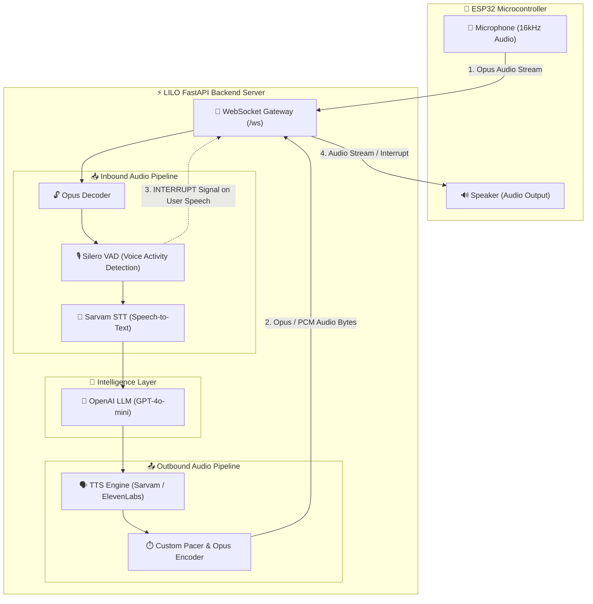

# 🪄 LILO Voice Assistant Backend

Real-time, low-latency AI voice assistant server for **ESP32 microcontrollers**, powered by the [Pipecat AI](https://github.com/pipecat-ai/pipecat) framework and FastAPI.

---

## 🌟 Overview

**LILO Voice Assistant Backend** is designed for real-time bidirectional audio streaming over WebSockets. It handles hardware interactions with embedded devices like ESP32 microcontrollers, performing real-time speech-to-text (STT), natural language processing via LLMs, and high-quality text-to-speech (TTS) streaming.

- 🎙️ **Streaming Speech-to-Text**: Fast input processing with [Sarvam AI](https://sarvam.ai/).
- 🧠 **Conversational Intelligence**: Powered by OpenAI models (e.g. `gpt-4o-mini`).
- 🔊 **Dual TTS Engine Support**: Flexible choice between **Sarvam AI TTS** (`bulbul:v3`) and **ElevenLabs TTS** (`eleven_turbo_v2_5`).
- ⚡ **Low Latency & Resilient Audio**: Features custom Opus audio encoding/decoding, Silero Voice Activity Detection (VAD), and dynamic audio pacing.
- 📡 **Hardware Handshake & WebSockets**: Robust protocol for ESP32 devices with real-time interrupt handling.

---

## 🏗️ Architecture & Pipeline Flow



---

## 📁 Directory Structure

```
LILO_BACKEND/
├── main.py                     # Application entry point & FastAPI web server
├── websocket_handler.py        # Handshake protocol & connection management
├── config/
│   └── settings.py             # System configuration, prompt & environment loading
├── pipeline/
│   ├── assistant.py            # Pipecat pipeline construction & worker setup
│   ├── context.py              # LLM context & conversation memory
│   ├── decoder.py              # Incoming audio decoding pipeline block
│   ├── encoder.py              # Outgoing audio encoding pipeline block
│   ├── frames.py               # Custom frame definitions
│   └── pacer.py                # Audio pacing controller for stream stabilization
├── services/
│   ├── stt.py                  # Sarvam Speech-to-Text integration
│   ├── llm.py                  # OpenAI LLM integration
│   └── tts/                    # Text-to-Speech providers
│       ├── sarvamtts.py        # Sarvam AI TTS
│       └── elevenlabs.py       # ElevenLabs TTS
├── transports/
│   └── esp32_transport.py      # Pipecat transport tailored for ESP32 WebSockets
├── utils/
│   ├── audio_rate_controller.py# Dynamic audio packet flow rate regulator
│   └── opus_encoder.py         # PyOgg Opus library encoder wrapper
├── Dockerfile                  # Container definition
├── docker-compose.yml          # Container orchestration
└── requirements.txt            # Python dependencies
```

---

## ⚙️ Configuration & Environment Variables

Create a `.env` file in the root directory based on `.env.example`:

```bash
cp .env.example .env
```

| Variable | Description | Default / Example |
| :--- | :--- | :--- |
| `OPENAI_API_KEY` | API Key for OpenAI LLM | `sk-...` |
| `SARVAM_API_KEY` | API Key for Sarvam STT / TTS | `your_sarvam_key` |
| `TTS_PROVIDER` | Active TTS engine choice (`sarvam` or `elevenlabs`) | `sarvam` |
| `ELEVENLABS_API_KEY` | Optional. Required if `TTS_PROVIDER=elevenlabs` | `your_elevenlabs_key` |
| `ELEVENLABS_VOICE_ID`| ElevenLabs Voice Identifier | `21m00Tcm4TlvDq8ikWAM` |
| `ELEVENLABS_MODEL`   | ElevenLabs Model Version | `eleven_turbo_v2_5` |
| `SARVAM_STT_LANGUAGE`| STT target language code | `en-IN` |
| `SARVAM_TTS_LANGUAGE`| Sarvam TTS output language code | `en-IN` |
| `SERVER_HOST` | Host IP binding for FastAPI server | `0.0.0.0` |
| `SERVER_PORT` | Port number for server | `8000` |
| `RELOAD` | Enable hot-reloading for development | `False` |

---

## 🚀 Getting Started

### Prerequisites

- **Python**: `3.10` or higher (Python `3.12` recommended)
- **C Libraries**: `libopus` / `opus` library installed on the host system.

---

### 1. Local Setup (Virtual Environment)

#### Windows:
```powershell
# Create and activate virtual environment
python -m venv venv
.\venv\Scripts\activate

# Install dependencies
pip install -r requirements.txt

# Start the server
python main.py
```

> **Note for Windows Users**: `main.py` automatically configures `timeBeginPeriod(1)` for 1ms timer precision and resolves local Opus DLL paths from `pyogg`.

#### Linux / macOS:
```bash
# Install system Opus development libraries
sudo apt-get update && sudo apt-get install -y libopus-dev gcc

# Setup virtual environment
python3 -m venv venv
source venv/bin/activate

# Install dependencies
pip install -r requirements.txt

# Run server
python main.py
```

---

### 2. Running with Docker 🐳

You can build and launch the application using Docker Compose:

```bash
# Build and run container in detached mode
docker-compose up --build -d

# View server logs
docker-compose logs -f
```

The server will be available at `http://localhost:8000`.

---

## 🤝 Handshake & WebSocket Protocol

ESP32 microcontrollers communicate with the backend via the `/ws` endpoint over WebSockets.

### 1. Client Handshake Request
Upon establishing a WebSocket connection, the client sends a JSON text message within 10 seconds:

```json
{
  "type": "hello",
  "version": "1.0"
}
```

### 2. Server Handshake Response
The server responds with configuration metadata:

```json
{
  "type": "hello",
  "transport": "websocket",
  "audio_params": {
    "sample_rate": 24000,
    "frame_duration": 60
  }
}
```

### 3. Bidirectional Audio Streaming
- **Input (ESP32 → Server)**: Binary messages containing **Opus-encoded mono audio at 16kHz**.
- **Output (Server → ESP32)**: Binary messages containing **Opus-encoded or PCM linear16 audio at 24kHz**.
- **Interruption Event**: Text message `"[INTERRUPT]"` sent to the client when user speech is detected mid-response.

---

## 🏥 Health Check Endpoint

Validate server health via HTTP GET:

```bash
curl http://localhost:8000/
```

**Response**:
```json
{
  "status": "running",
  "service": "LILO Voice Assistant",
  "version": "1.0.0"
}
```
